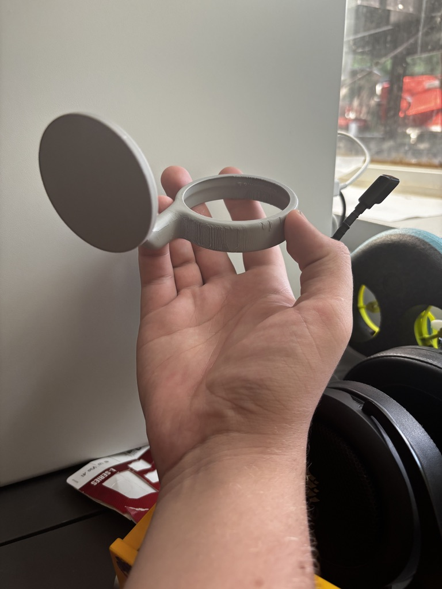
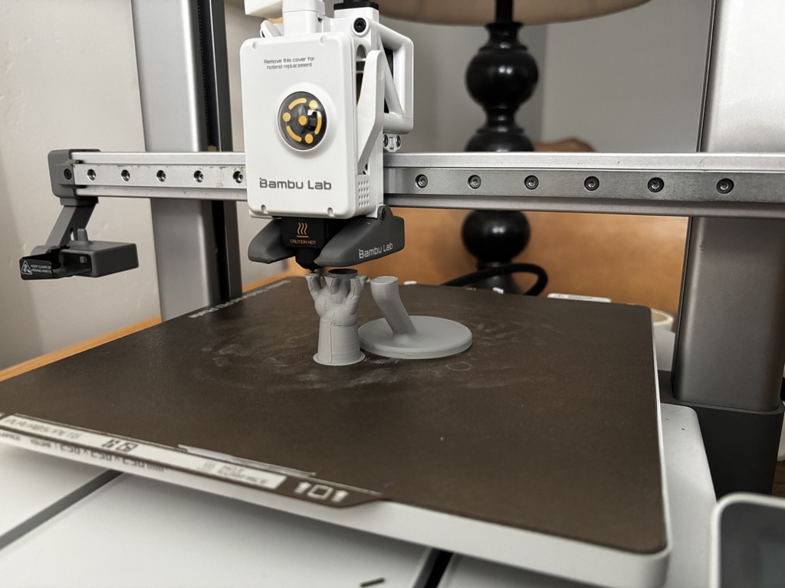

<link rel="stylesheet" href="style.css">
I’m a 18 year old college student looking to fund my education, I have a 3D printer and am willing to print stuff for you, payment is done through <a href="https://www.venmo.com/u/Evan-J-Barclay">Venmo</a> and I ship through usps

<button class="button-40" role="button"><a href="https://forms.gle/eEWjGUsopVvQxeCq8">Order Here</a></button>
<iframe src="https://docs.google.com/forms/d/e/1FAIpQLSfDquPpvKuVUtfdUuNoEJkTShx1LqEno2CwIB1R0o46PM_SCQ/viewform?embedded=true" width="100%" height="2000" frameborder="0" marginheight="0" scrolling="no" marginwidth="0">Loading…</iframe>
 
<h1>FAQ:</h1>
### What Can You Get?
Literally anything!

### Where do I ship?
Anywhere in the continental US (i ship through USPS)

### how much does it cost
That’s up to you. Pricing consists of materials + labor + shipping normaly ~= $10-$15

### Why am I doing this?
I’m just a college student looking to not Starve to death

## Previous Orders

  
Dustins Spray Paint Phone Mount

  
  

